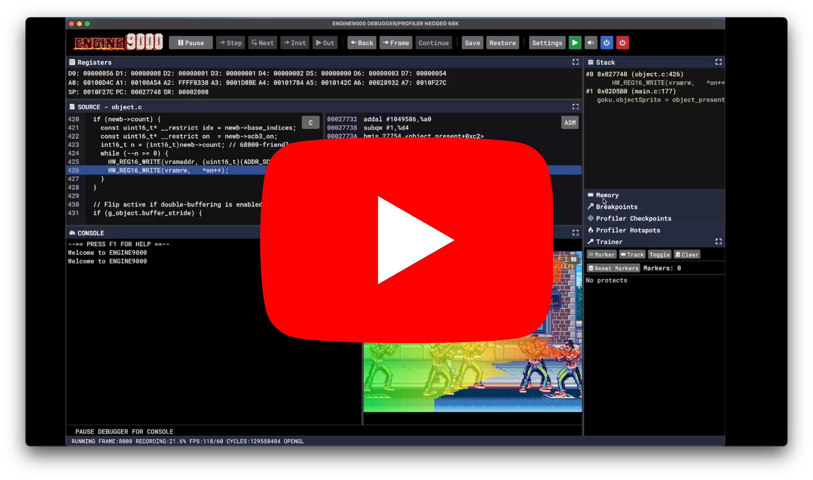
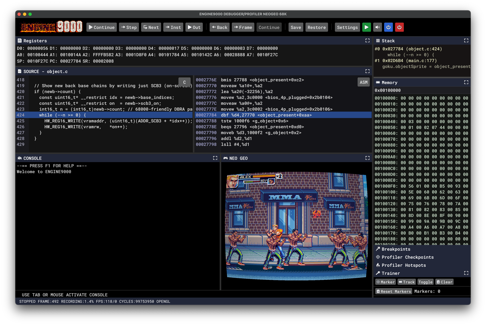
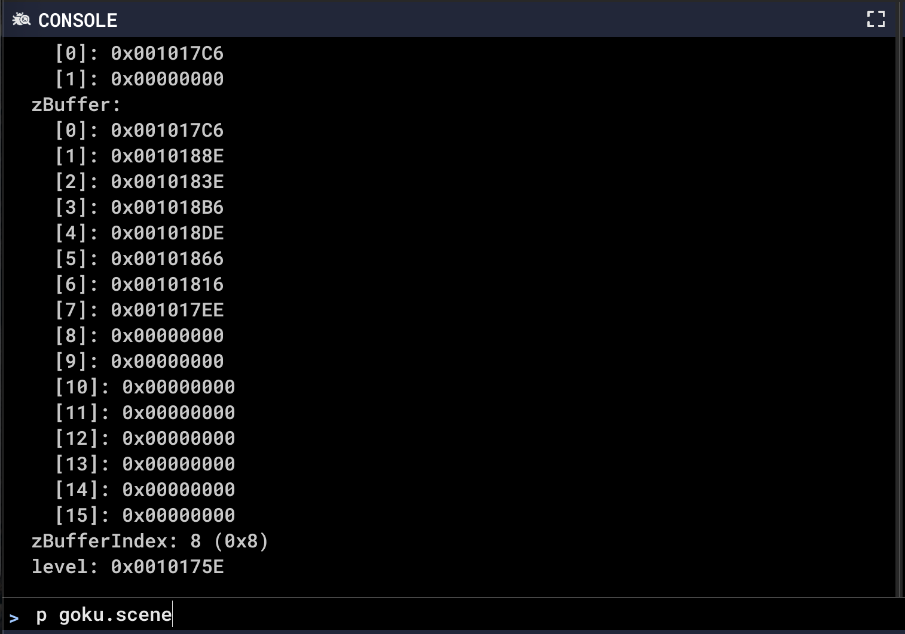
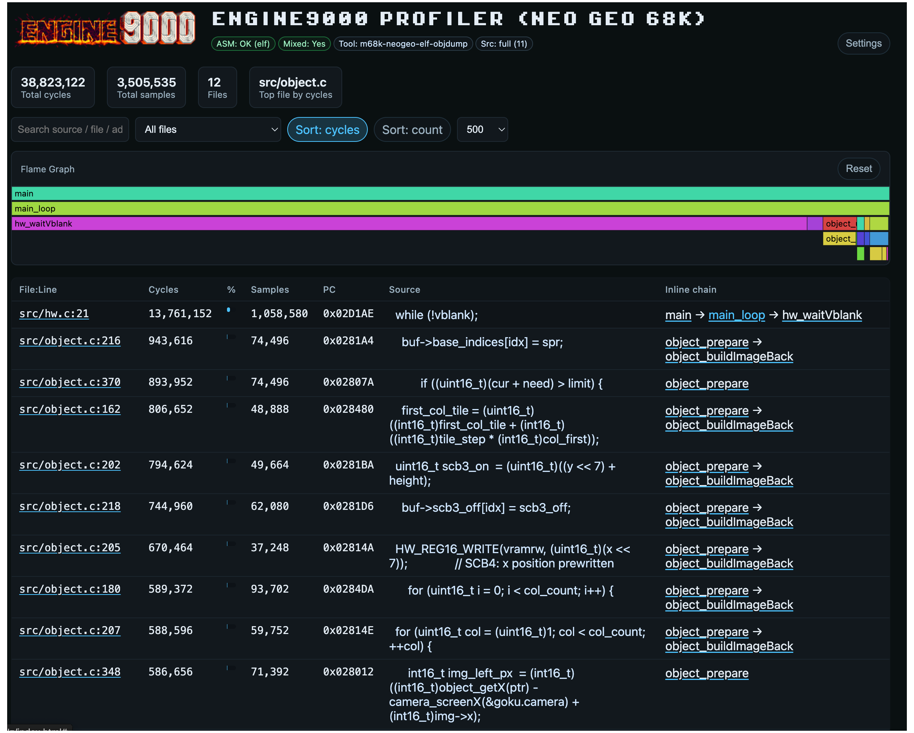
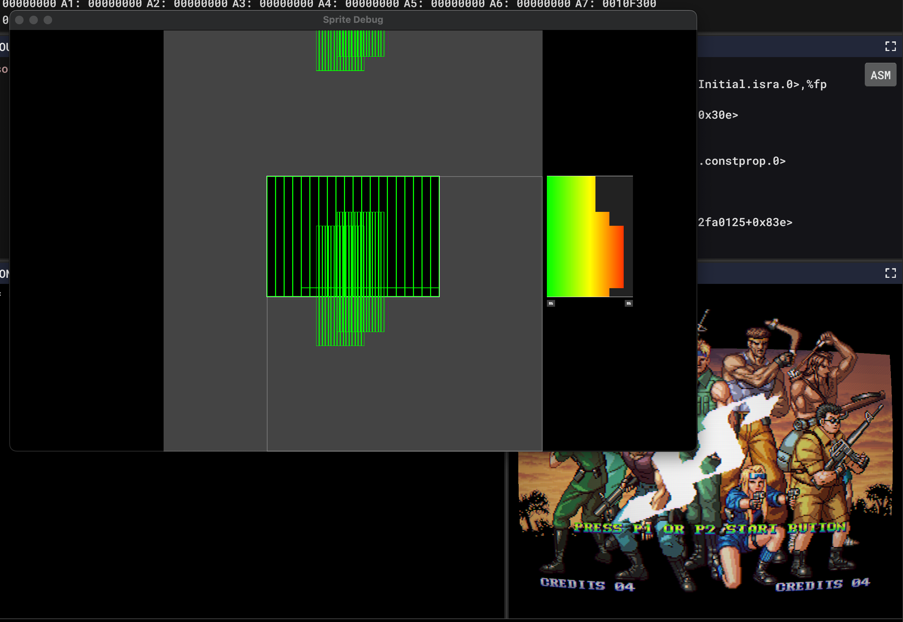

# ENGINE9000 68k Retro Debugger/Profiler

Amiga/Neo Geo debugger/profiler - under heavy development so likely to be unstable for the time being. 

Expect file format changes and other incompatibilities with new versions. 

The UI is custom SDL2, so expect some weird UI experiences.

Amiga version does not support ELF yet, or it might if you install ngdevkit's toolchain.

  

Project layout

- `e9k-debugger` - The debugger project
- `geo9000` - Neo Geo emulator - (forked from `geolith-libretro` https://github.com/libretro/geolith-libretro)
- `ami9000` - Amiga emulator - (fored from `libretro-uae` https://github.com/libretro/libretro-uae)

Supported platforms:

- macOS
- Windows via MinGW (`x86_64-w64-mingw32`); so far only tested by cross-compiling from macOS

---

## What `e9k-debugger` Does

- ASM/C Source level debugger (needs ELF with DWARF - currently Neo Geo only)
- Amiga/Neo Geo emulators with frame level rewind/fast forward and simple CRT shader
- Source level profiler
- Trainer/cheat mode
- Smoke tester (record scenarios, replay, check all video frames identical)
- Fake Neo Geo peripherals for debug console and profile checkpoints
- Neo Geo Sprite debug visualiser

### Debugging Features

- UI or Console based debug
- Pause / continue
- Step line / step instruction / next (step over)
- Breakpoints by:
  - Absolute address
  - Symbol name
  - `file:line`
- Watchpoints, with filters such as:
  - Read/write/rw
  - Access size (`8|16|32`)
  - Address mask compare
  - Value/old-value/diff predicates
- Memory write (by address or by symbol)
- “Protect” (memory protection / cheat):
  - Block writes to an address (optionally sized)
  - Force a value at an address (optionally sized)
- Frame step
- Frame reverse

### Neo Geo Fake Peripherals

- `0xFFFF0` - characters written to this address will be output in the console and terminal
- `0xFFFEC` - writing a checkpoint slot from 0-64 for checkpoint profiling stats
- These overlay with ROM addresses - other emulators or real neo geo might crash if you use these

### Profiling Features

There are two complementary profiling mechanisms:

- **Streaming sampler profiler**: starts/stops sampling in the emulator.
  - Aggregates samples into “Profiler Hotspots”.
  - Analysis/export can emits a web bases results view.
- **Checkpoint profiler**: a fixed set of lightweight “checkpoints”.
  - Checkpoints are set by the target by writing to a fake peripheral
  - Checkpoint execution stats displayed

### Timeline / Rewind-Oriented Tools

The debugger keeps a rolling save-state timeline (“state buffer”) implemented as keyframes + diffs:

- You can use a hidden seek bar at the bottom of the emulator window to set the current frame
- When you release the seek bar, any stats saved ahead of the seek bar are trimmed
- If you want to be able to seek around without losing data, save state first "Save" from toolbar
- Restoring this with "Restore" will restore your full timeline
- Frame-step controls (frame stepping uses the state buffer)
- `loop` between two recorded frame numbers
- `diff` memory between two recorded frame numbers

### Automation / Regression Helpers

`e9k-debugger` includes first-class capture/replay tooling:

- Input recording to a file (`--record`) and replay (`--playback`)
- Smoke test recording (`--make-smoke`) and compare mode (`--smoke-test`)
  - Designed for “record inputs + frames” and later replay/compare

### Sprite Debug Window

- Available via a hidden button in the emulator window - hover in top right hand corner to reveal
- Renders a full view of the Neo Geo coordinate space allowing visualsation of off screen sprites
- Renders a "sprite-line" histogram showing how close you are to hitting the Neo Geo sprites-per-line limits

## Trainer
- Simple training function
- Set Markers, analyse which ram addresses have changed between marker
- Protect ram locations of interest (infinite lives etc)
- Protections for matching roms are persisted, reloaded

## Save States
- e9k-debugger automaically saves a save state every frame (differential) - this allows you to rewind/fast forward etc
- When you do a "Save/Restore" it saves the entire save state buffer - this will be saved in your configured "saves" folder on exit
- Save states include a hash of the rom
- When you start if a save state is available matching the filename and hash it will be loaded ready for a restore
- This restore will include full history

## Transitions
- e9k-debugger is a playground for me to play with transitions - if you don't like them, go to the settings screen and untick "fun"

## CRT Shader
- e9k-debugger includes a relatively simple CRT shader, a settings dialog is available via a hidden button in the emulator window. Hover in the top right hand corner to reveal.

---

## Controls

Clicking on a title bar collapses the panel, for horizontal panels click the icon to restore.

Global debugger hotkeys

| Key | Action |
|---|---|
| `F1` | Help |
| `F2` | Screenshot to clipboard |
| `F3` | Toggle CRT mode |
| `F4` | Toggle FPS overlay |
| `F5` | Speed toggle |
| `F6` | Toggle audio |
| `F7` | Save state |
| `F8` | Restore state |
| `ESC` | Toggle fullscreen |
| `TAB` | Focus the console prompt |
| `c` | Continue |
| `p` | Pause |
| `s` | Step (source line) |
| `n` | Next (step over) |
| `i` | Step instruction |
| `b` | Frame step back |
| `f` | Frame step |
| `g` | Frame continue |
| `,` | Checkpoint profiler toggle |
| `.` | Checkpoint profiler reset |
| `/` | Checkpoint profiler dump to stdout |

---

## Console Commands

### `help` (alias: `h`)

SYNOPSIS  
`help [command]`

DESCRIPTION  
Lists available commands. With an argument, prints the help/usage for that specific command (aliases are accepted).

EXAMPLES  
`help`  
`help break`  
`help b`

---

### `break` (alias: `b`)

SYNOPSIS  
`break <addr|symbol|file:line>`

DESCRIPTION  
Adds a breakpoint. Resolution order is:

1. `file:line` 
2. Hex address (24-bit; `0x` prefix optional)
3. Symbol

NOTES  
Requires a configured ELF path (Settings → `ELF`, or `--elf PATH`).

EXAMPLES  
`break 0x00A3F2`  
`break player_update`  
`break foo.c:123`

---

### `continue` (alias: `c`)

SYNOPSIS  
`continue`

DESCRIPTION  
Resumes execution defocuses the console prompt.

---

### `cls`

SYNOPSIS  
`cls`

DESCRIPTION  
Clears the console output buffer.

---

### `step` (alias: `s`)

SYNOPSIS  
`step`

DESCRIPTION  
Steps to the next source line

---

### `next` (alias: `n`)

SYNOPSIS  
`next`

DESCRIPTION  
Steps over the next line

---

### `stepi` (alias: `i`)

SYNOPSIS  
`stepi`

DESCRIPTION  
Steps a single instruction

---

### `print` (alias: `p`)

SYNOPSIS  
`print <expr>`

DESCRIPTION  
Evaluates and prints an expression using DWARF + symbol information from the configured ELF.

There is also a fast path for simple numeric expressions so that dereferences like `print *0xADDR` work even without an ELF:

- `print 1234`
- `print 0x00100000`
- `print *0x00100000`
- `print *(0x00100000)`

EXAMPLES  
`print playerLives`  
`print *0x00100000`

---

### `write`

SYNOPSIS  
`write <dest> <value>`

DESCRIPTION  
Writes a hex value to an address or symbol.

- If `<dest>` looks like a hex address (`0x...`), it writes directly to that address.
- Otherwise `<dest>` is treated as a symbol and resolved via the expression/symbol resolver.

The write size is inferred from the number of hex digits in `<value>`:

- `0xNN` → 8-bit
- `0xNNNN` → 16-bit
- `0xNNNNNNNN` → 32-bit

NOTES  
`<value>` must be strict hex with a `0x` prefix.

EXAMPLES  
`write 0x0010ABCD 0xFF`  
`write someGlobal 0x0001`

---

### `watch` (alias: `wa`)

SYNOPSIS  
`watch [addr] [r|w|rw] [size=8|16|32] [mask=0x...] [val=0x...] [old=0x...] [diff=0x...]`  
`watch del <idx>`  
`watch clear`

DESCRIPTION  
Lists, adds, or removes watchpoints.

- With no arguments, prints the current watchpoint table plus the enabled mask.
- `watch clear` resets all watchpoints.
- `watch del <idx>` removes a watchpoint by index.
- Otherwise, adds a watchpoint at `<addr>` with the selected options.

OPTIONS  
`r`, `w`, `rw` select access type. If omitted, defaults to `rw`.  
`size=8|16|32` matches access size.  
`mask=0x...` applies an address compare mask.  
`val=0x...` matches a value equality operand.  
`old=0x...` matches an old-value equality operand.  
`diff=0x...` (or `neq=0x...`) matches “value != old” (with an operand).

EXAMPLES  
`watch`  
`watch 0x0010ABCD rw size=16`  
`watch 0x0010ABCD w val=0x00000010`  
`watch del 3`  
`watch clear`

---

### `train`

SYNOPSIS  
`train <from> <to> [size=8|16|32]`  
`train ignore`  
`train clear`

DESCRIPTION  
Convenience command for “training” by breaking on a value transition.

- `train <from> <to>` installs a watchpoint that triggers when a write changes a value from `<from>` to `<to>`.
  - `<from>` and `<to>` accept decimal or `0x...` hex.
  - The watchpoint matches any address (mask `0`).
- `train ignore` adds the last triggered watchbreak address to an ignore list.
- `train clear` clears the ignore list.

EXAMPLES  
`train 3 2 size=8`  
`train 0x03 0x02`  
`train ignore`

---

### `protect`

SYNOPSIS  
`protect`  
`protect clear`  
`protect del <addr> [size=8|16|32]`  
`protect <addr> block [size=8|16|32]`  
`protect <addr> set=0x... [size=8|16|32]`

DESCRIPTION  
Manages “protect” rules:

- `block`: prevent writes to an address (optionally sized)
- `set=...`: force a value at an address (optionally sized)

With no arguments, prints the current enabled protect entries.

EXAMPLES  
`protect`  
`protect 0x0010ABCD block size=16`  
`protect 0x0010ABCD set=0x00000063 size=8`  
`protect del 0x0010ABCD size=8`  
`protect clear`

---

### `loop`

SYNOPSIS  
`loop <from> <to>`  
`loop`  
`loop clear`

DESCRIPTION  
Loops between two recorded frame numbers (decimal) in the state buffer. Both frames must exist in the state buffer.

NOTES  
The state buffer size is configurable via `E9K_STATE_BUFFER_BYTES` (see “Runtime Requirements”).

EXAMPLES  
`loop 120 180`  
`loop`  
`loop clear`

---

### `diff`

SYNOPSIS  
`diff <fromFrame> <toFrame> [size=8|16|32]`

DESCRIPTION  
Shows RAM addresses that differ between two recorded frames (state buffer), scanning:

- Main RAM (`0x00100000` .. `0x0010FFFF`)
- Backup RAM (`0x00D00000` .. `0x00D0FFFF`)

Output is truncated after 4096 lines.

EXAMPLES  
`diff 120 180`  
`diff 120 180 size=16`

---

### `transition`

SYNOPSIS  
`transition <slide|explode|doom|flip|rbar|random|cycle|none>`

DESCRIPTION  
Sets the transition mode used for startup and fullscreen transitions and persists it to the config.

EXAMPLES  
`transition random`  
`transition none`

---

## Runtime Requirements

### Neo Geo BIOS ROMs (required)

BIOS files are not included. You must supply a valid Neo Geo BIOS set in the **system/BIOS directory**.

- Default system directory: `./system`
- Set via Settings UI: `BIOS FOLDER`
- Or via CLI: `--libretro-system-dir PATH`

In this repo, the default `./system` directory corresponds to `e9k-debugger/system` when running from the `e9k-debugger` directory. In practice this is typically a BIOS archive such as `neogeo.zip` (MVS / UniBIOS) or `aes.zip` (AES), placed inside the system directory.

### Game ROMS

`e9k-debugger` can load .neo files or attempt to automatically create a .neo file from a mame style rom set. 

- It uses two naming conventions:
  - the files with a rom specific file extension (.p1, .m1, .v1 etc)
  - the filename prior to the extension has a rom designation (rom-p1.bin)
- Use the ROM Folder to load mame style rom sets.

### Amiga UAE File

Amiga config is specified by selecting a puae format .uae file

### Amiga Kickstart ROMs (required)

- Kickstart ROMS are not included. Kickstart rom paths should be set in the .uae file 
- Please still set the system folder

### Amiga Disks/Configs

- Unsure at this stage how higher end configs work
- Really designed for minimal A500/512/512 configs
- For more complex configs we will need to add a way to disable rolling snapshot

### Emulator Platform defaults:

- macOS default core paths: `./system/geolith_libretro.dylib` for Neo Geo and `./system/puae_libretro.dylib` for Amiga
- Windows default core paths: `./system/geolith_libretro.dll` for Neo Geo and `./system/puae_libretro.dll` for Amiga

### ELF + toolchain (required for source/symbol features) (Currently Neo Geo only)

For source-level stepping, symbol breakpoints, and rich `print` expressions, you must provide:

- An ELF compiled with DWARF debug info (`Settings → ELF`, or `--elf PATH`)
- The Neo Geo toolchain binaries on `PATH`:
  - `m68k-neogeo-elf-addr2line`
  - `m68k-neogeo-elf-objdump`
  - `m68k-neogeo-elf-readelf`

Without these, the debugger can still run, but symbol/source-aware features degrade or become unavailable.

### Config file + environment variables

Config is persisted automatically (layout + settings):

- macOS: `~/.e9k-debugger.cfg`
- Windows: `%APPDATA%\\e9k-debugger.cfg` (falls back to `%USERPROFILE%`)

Useful environment variables:

- `E9K_STATE_BUFFER_BYTES`: state buffer capacity (default is `64*1024*1024`)
- `E9K_PROFILE_JSON`: output path for profiler analysis JSON (otherwise a temp file is used)

### Command-line options

Run `e9k-debugger --help` for the full list. The current options include:

#### Neo Geo only (not implemented in Amiga uet)
- `--elf PATH`
- `--libretro-core PATH`
- `--libretro-rom PATH`
- `--rom-folder PATH` (generates a `.neo`)
- `--libretro-system-dir PATH`
- `--libretro-save-dir PATH`
- `--source-dir PATH`
- `--audio-buffer-ms MS`

#### Shared options
- `--window-size WxH`
- `--record PATH`, `--playback PATH`
- `--make-smoke PATH`, `--smoke-test PATH`, `--smoke-open`
- `--no-gl-composite`

---

## Copyright/License

e9k-debugger/ Copyright (C) 2026 Enable Software Pty Ltd

This project contains files with various licenses, unless otherwise specified assume GNU General Public License, version 2.

---

## Building

### macOS

1) Build the debugger:

- `cd e9k-debugger`
- `make`

2) Build the geo9000 emulator:

- `cd geo9000/libretro`
- `./build.sh`

3) Build the ami9000 emulator
- `cd ami9000`
- `make -j30`
- produces `puae_libretro.dll` and copies it into `../e9k-debugger/system`
Notes:

- `e9k-debugger` links against at least: SDL2, SDL2_ttf, SDL2_image, readline, and OpenGL/Cocoa frameworks.
- The macOS build currently links sanitizers (`-fsanitize=address,undefined`) by default; adjust the Makefile if you want a non-sanitized release build.
- Typical Homebrew deps: `brew install sdl2 sdl2_image sdl2_ttf readline`
- `geo9000/libretro/build.sh` produces `geolith_libretro.dylib` and copies it into `e9k-debugger/system`.

### Windows (MinGW, cross-compiling)

Windows builds use a `x86_64-w64-mingw32` toolchain and have so far only been tested by cross-compiling from macOS.

1) Build the debugger:

- `cd e9k-debugger`
- `make w64` produces `dist/e9kd/e9k-debugger`

2) Build the geo9000 emulator

- `cd geo9000/libretro`
- `./build_w64.sh`
- `geo9000/libretro/build.sh` produces `geolith_libretro.dll` and copies it into `e9k-debugger/system`.

3) Build the ami9000 emulator
- `cd ami9000`
- `platform=win CC=x86_64-w64-mingw32-gcc make -j30`
- produces `puae_libretro.dll` and copies it into `../e9k-debugger/system`

You are likely to need to recreate my dist directory structure for the w64 build - I currently have dist/e9kd/ which contains the exe and any dll (SDL etc) used to link, inside that I symlink to ../../assets and ../../system - you will also need a "saves" folder 
